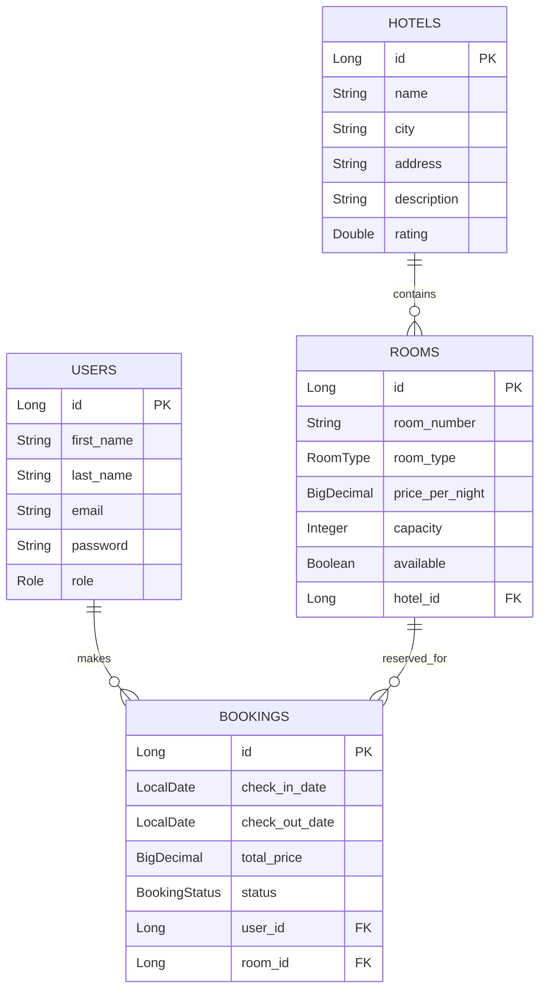

# Hotel Booking System

A backend REST API for hotel booking management built with Spring Boot, PostgreSQL, and JWT Authentication.

## Overview

Hotel Booking System is a backend application that allows users to register, login, and manage hotel bookings through secure REST APIs.

The project is built as a portfolio backend project using Java and Spring Boot, with a clean layered architecture and JWT-based authentication.

## Features

* User Registration
* User Login
* Password Encryption using BCrypt
* JWT Authentication
* Role-Based Authorization
* Admin Protected APIs
* PostgreSQL Database Integration
* Spring Data JPA / Hibernate
* RESTful API Structure
* Database ERD Design
* Maven Project Structure

## Tech Stack

* Java 21
* Spring Boot
* Spring Web
* Spring Security
* Spring Data JPA
* Hibernate
* PostgreSQL
* JWT
* Maven
* Lombok
* Git & GitHub
* Postman

## Project Structure

```text
src/main/java/com/train/hotel_booking_system
│
├── config
│   └── SecurityConfig.java
│
├── controller
│   ├── AuthController.java
│   ├── UserController.java
│   └── AdminController.java
│
├── dto
│   ├── RegisterRequest.java
│   ├── UserResponse.java
│   ├── LoginRequest.java
│   └── LoginResponse.java
│
├── entity
│   ├── User.java
│   ├── Role.java
│   ├── Hotel.java
│   ├── RoomType.java
│   └── BookingStatus.java
│
├── repository
│   └── UserRepository.java
│
├── security
│   ├── JwtService.java
│   └── JwtAuthenticationFilter.java
│
├── service
│   └── UserService.java
│
└── HotelBookingSystemApplication.java
```

## Authentication & Authorization

The system uses JWT Authentication.

After login, the user receives a JWT token and must send it in the Authorization header for protected endpoints.

```text
Authorization: Bearer <JWT_TOKEN>
```

The system currently supports two roles:

```text
USER
ADMIN
```

Admin-only routes are protected using role-based authorization.

## API Endpoints

### Register User

```http
POST /api/users/register
```

Request Body:

```json
{
  "firstName": "Mohamed",
  "lastName": "Hendy",
  "email": "mohamed@example.com",
  "password": "123456"
}
```

### Login

```http
POST /api/auth/login
```

Request Body:

```json
{
  "email": "mohamed@example.com",
  "password": "123456"
}
```

Response:

```json
{
  "token": "JWT_TOKEN_HERE"
}
```

### Get Authenticated User Test

```http
GET /api/auth/me
```

Authorization:

```text
Bearer <JWT_TOKEN>
```

### Admin Dashboard Test

```http
GET /api/admin/dashboard
```

Authorization:

```text
Bearer <ADMIN_JWT_TOKEN>
```

Expected Response:

```text
Welcome Admin
```

If a normal user tries to access this endpoint, the response will be:

```text
403 Forbidden
```

## Database Configuration

The project uses PostgreSQL.

The database name should be:

```text
hotel_booking_db
```

Application configuration uses environment variables for sensitive data.

```properties
spring.datasource.url=jdbc:postgresql://localhost:5432/hotel_booking_db
spring.datasource.username=postgres
spring.datasource.password=${DB_PASSWORD}

jwt.secret=${JWT_SECRET}
jwt.expiration=86400000
```

Do not commit real database passwords or JWT secrets to GitHub.

## Environment Variables

Before running the project, configure:

```text
DB_PASSWORD=your_postgres_password
JWT_SECRET=your_long_jwt_secret
```

Example for local development only:

```text
DB_PASSWORD=your_password
JWT_SECRET=your_long_secret_key_for_local_development
```

## Database ERD



## Current Progress

* User Registration
* User Login
* BCrypt Password Encryption
* JWT Token Generation
* JWT Authentication Filter
* Role-Based Authorization
* Admin Protected Endpoint
* PostgreSQL Connection
* Initial ERD Design
* Hotel Entity Started

## Upcoming Features

* Hotel Management APIs
* Room Management APIs
* Booking Management APIs
* Booking Availability Check
* Booking Status Workflow
* Global Exception Handling
* Request Validation Improvements
* API Documentation
* Unit and Integration Tests

## How to Run Locally

1. Clone the repository:

```bash
git clone https://github.com/mohameedhendy/hotel-booking-system.git
```

2. Open the project in IntelliJ IDEA.

3. Create PostgreSQL database:

```sql
CREATE DATABASE hotel_booking_db;
```

4. Set environment variables:

```text
DB_PASSWORD=your_postgres_password
JWT_SECRET=your_long_jwt_secret
```

5. Run the application:

```bash
./mvnw spring-boot:run
```

Or run the main class:

```text
HotelBookingSystemApplication
```


## Database ERD

erDiagram
    USERS ||--o{ BOOKINGS : makes
    HOTELS ||--o{ ROOMS : contains
    ROOMS ||--o{ BOOKINGS : reserved_for

    USERS {
        Long id PK
        String first_name
        String last_name
        String email
        String password
        Role role
    }

    HOTELS {
        Long id PK
        String name
        String city
        String address
        String description
        Double rating
    }

    ROOMS {
        Long id PK
        String room_number
        RoomType room_type
        BigDecimal price_per_night
        Integer capacity
        Boolean available
        Long hotel_id FK
    }

    BOOKINGS {
        Long id PK
        LocalDate check_in_date
        LocalDate check_out_date
        BigDecimal total_price
        BookingStatus status
        Long user_id FK
        Long room_id FK
    }

## Author

Mohamed Hendy

Backend Developer | Java & Spring Boot
