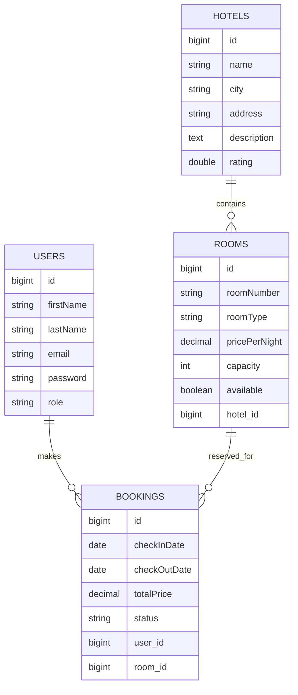

# Hotel Booking System

A backend-only hotel booking system built with **Java** and **Spring Boot**.
The project focuses on building a clean REST API for hotel management, room management, user authentication, authorization, and booking workflows.

---

## Project Overview

The system allows users to browse hotels and rooms, register/login, and create bookings.
Admins can manage hotels, rooms, bookings, and booking statuses.

This project was built as a practical backend project to apply:

* REST API design
* Authentication and JWT
* Role-based authorization
* Database relationships
* Booking business logic
* Validation and error handling
* Pagination and filtering

---

## Tech Stack

* Java 21
* Spring Boot
* Spring Web
* Spring Security
* JWT Authentication
* Spring Data JPA
* Hibernate
* PostgreSQL
* Bean Validation
* Lombok
* Maven
* Postman for API testing

---

## Main Features

### Authentication & Authorization

* User registration
* User login
* JWT token generation
* Role-based access control
* Roles:

    * USER
    * ADMIN

### Hotel Management

* Admin can create hotels
* Admin can update hotels
* Admin can delete hotels
* Public users can view hotels
* Public users can search hotels by city
* Pagination and sorting for hotels

### Room Management

* Admin can create rooms for a hotel
* Admin can update rooms
* Admin can delete rooms
* Public users can view rooms
* Public users can filter available rooms
* Public users can filter rooms by room type
* Pagination and sorting for rooms

### Booking Management

* User can create a booking
* System calculates number of nights
* System calculates total price automatically
* System prevents overlapping bookings for the same room
* User can view their bookings
* User can cancel their booking
* Admin can view all bookings
* Admin can update booking status

### Error Handling

* Global exception handling
* Validation error responses
* Clean API error response format
* Improved authentication error messages

---

## Database Design



---

## Enums

### Role

```text
USER
ADMIN
```

### RoomType

```text
SINGLE
DOUBLE
SUITE
DELUXE
```

### BookingStatus

```text
PENDING
CONFIRMED
CANCELLED
COMPLETED
```

---

## API Endpoints

## Authentication

### Register

```http
POST /api/users/register
```

Request body:

```json
{
  "firstName": "Mohamed",
  "lastName": "Hendy",
  "email": "mohamed@gmail.com",
  "password": "123456"
}
```

### Login

```http
POST /api/auth/login
```

Request body:

```json
{
  "email": "mohamed@gmail.com",
  "password": "123456"
}
```

Response:

```json
{
  "token": "jwt-token-here"
}
```

### Get Current User

```http
GET /api/auth/me
```

Authorization:

```text
Bearer Token
```

---

# Public APIs

These endpoints can be accessed without authentication.

## Hotels

### Get All Hotels

```http
GET /api/hotels
```

### Get Hotel By ID

```http
GET /api/hotels/{hotelId}
```

### Get Rooms By Hotel

```http
GET /api/hotels/{hotelId}/rooms
```

### Search Hotels By City

```http
GET /api/hotels/search?city=Riyadh
```

### Hotels Pagination & Sorting

```http
GET /api/hotels/paged?page=0&size=5&sortBy=rating&direction=desc
```

---

## Rooms

### Get Room By ID

```http
GET /api/rooms/{roomId}
```

### Get Available Rooms

```http
GET /api/rooms/available
```

### Get Rooms By Type

```http
GET /api/rooms/type/DOUBLE
```

### Rooms Pagination & Sorting

```http
GET /api/rooms/paged?page=0&size=5&sortBy=pricePerNight&direction=asc
```

---

# User Booking APIs

These endpoints require a logged-in user token.

## Create Booking

```http
POST /api/bookings
```

Request body:

```json
{
  "roomId": 1,
  "checkInDate": "2026-07-01",
  "checkOutDate": "2026-07-05"
}
```

Response example:

```json
{
  "id": 1,
  "userId": 1,
  "userEmail": "mohamed@gmail.com",
  "roomId": 1,
  "roomNumber": "101",
  "hotelId": 1,
  "hotelName": "Hilton Riyadh",
  "checkInDate": "2026-07-01",
  "checkOutDate": "2026-07-05",
  "nights": 4,
  "totalPrice": 1000.00,
  "status": "PENDING"
}
```

## Get My Bookings

```http
GET /api/bookings/my
```

## Cancel My Booking

```http
PATCH /api/bookings/{bookingId}/cancel
```

---

# Admin APIs

These endpoints require an ADMIN token.

## Admin Dashboard

```http
GET /api/admin/dashboard
```

---

## Admin Hotel APIs

### Create Hotel

```http
POST /api/admin/hotels
```

Request body:

```json
{
  "name": "Hilton Riyadh",
  "city": "Riyadh",
  "address": "King Fahd Road",
  "description": "Luxury hotel in Riyadh",
  "rating": 4.8
}
```

### Get All Hotels

```http
GET /api/admin/hotels
```

### Get Hotel By ID

```http
GET /api/admin/hotels/{hotelId}
```

### Update Hotel

```http
PUT /api/admin/hotels/{hotelId}
```

Request body:

```json
{
  "name": "Hilton Riyadh Updated",
  "city": "Riyadh",
  "rating": 4.9
}
```

### Delete Hotel

```http
DELETE /api/admin/hotels/{hotelId}
```

Note: A hotel cannot be deleted if it has rooms.

---

## Admin Room APIs

### Create Room For Hotel

```http
POST /api/admin/rooms/hotel/{hotelId}
```

Request body:

```json
{
  "roomNumber": "101",
  "roomType": "DOUBLE",
  "pricePerNight": 250.00,
  "capacity": 2,
  "available": true
}
```

### Get All Rooms

```http
GET /api/admin/rooms
```

### Get Room By ID

```http
GET /api/admin/rooms/{roomId}
```

### Get Rooms By Hotel ID

```http
GET /api/admin/rooms/hotel/{hotelId}
```

### Update Room

```http
PUT /api/admin/rooms/{roomId}
```

Request body:

```json
{
  "pricePerNight": 300.00,
  "capacity": 3,
  "available": true
}
```

### Delete Room

```http
DELETE /api/admin/rooms/{roomId}
```

Note: A room cannot be deleted if it has bookings.

---

## Admin Booking APIs

### Get All Bookings

```http
GET /api/admin/bookings
```

### Update Booking Status

```http
PATCH /api/admin/bookings/{bookingId}/status
```

Request body:

```json
{
  "status": "CONFIRMED"
}
```

Available statuses:

```text
PENDING
CONFIRMED
CANCELLED
COMPLETED
```

---

## Error Response Format

Example:

```json
{
  "timestamp": "2026-06-17T15:50:00",
  "status": 404,
  "error": "Not Found",
  "message": "Hotel not found",
  "path": "/api/admin/hotels/999"
}
```

---

## Environment Variables

The project uses environment variables for sensitive configuration.

```properties
DB_PASSWORD=your_database_password
JWT_SECRET=your_jwt_secret
```

Example `application.properties`:

```properties
spring.application.name=hotel-booking-system

spring.datasource.url=jdbc:postgresql://localhost:5432/hotel_booking_db
spring.datasource.username=postgres
spring.datasource.password=${DB_PASSWORD}

spring.jpa.hibernate.ddl-auto=update
spring.jpa.show-sql=true
spring.jpa.properties.hibernate.format_sql=true
spring.jpa.open-in-view=false

jwt.secret=${JWT_SECRET}
jwt.expiration=86400000
```

Do not commit real passwords or secrets to GitHub.

---

## How To Run Locally

### 1. Clone the repository

```bash
git clone https://github.com/mohameedhendy/hotel-booking-system.git
```

### 2. Open the project in IntelliJ IDEA

Open the project folder and wait for Maven dependencies to load.

### 3. Create PostgreSQL database

Create a database named:

```text
hotel_booking_db
```

### 4. Add environment variables

In IntelliJ IDEA:

```text
Run → Edit Configurations → Environment variables
```

Add:

```text
DB_PASSWORD=your_database_password;JWT_SECRET=your_jwt_secret
```

### 5. Run the application

The application will start on:

```text
http://localhost:8080
```

---

## Current Status

The project currently includes:

* User authentication
* JWT authorization
* Role-based access control
* Hotel management
* Room management
* Booking workflow
* Booking status management
* Public hotel and room APIs
* Search and filtering
* Pagination and sorting
* Global exception handling
* Improved authentication errors

---

## Future Improvements

* Unit testing and integration testing
* Swagger / OpenAPI documentation
* Docker support
* Refresh tokens
* Booking payment simulation
* Advanced room availability search by date range
* Admin statistics dashboard

---

## Author

Mohamed Hendy

GitHub: https://github.com/mohameedhendy
